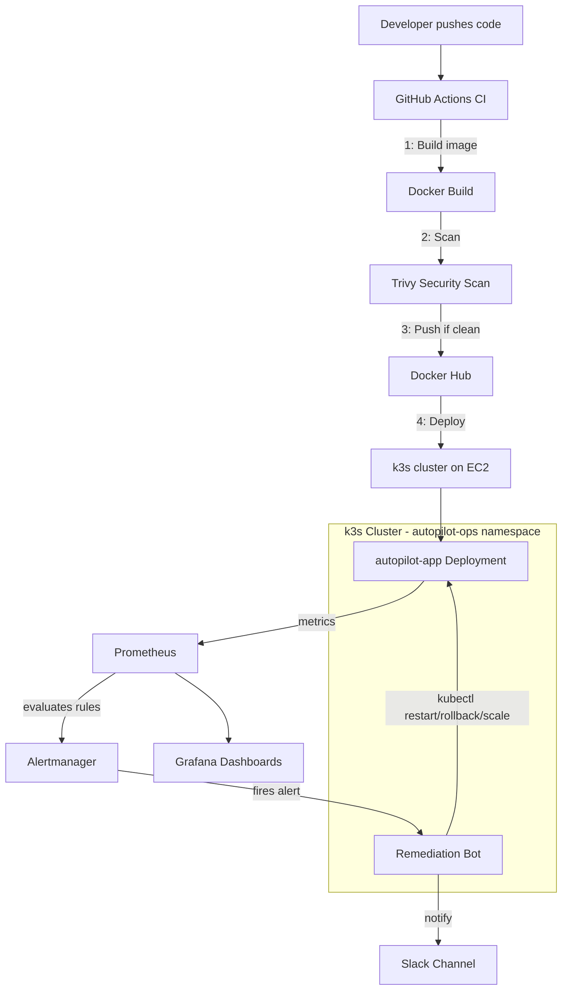

# Architecture

## Flow explained

1. **CI**: Every push to `main` triggers GitHub Actions, which builds the
   Docker image, scans it with Trivy, and only pushes to Docker Hub if no
   critical/high vulnerabilities are found.
2. **CD**: The workflow SSHes into the EC2 instance and updates the
   deployment image, triggering a zero-downtime rolling update.
3. **Observability**: Prometheus scrapes metrics from the app and cluster;
   Grafana visualizes them.
4. **Self-healing loop**: Prometheus alert rules (crash loops, high memory,
   degraded deployments) fire into Alertmanager, which forwards them via
   webhook to the remediation bot. The bot takes the appropriate `kubectl`
   action (restart, rollback, or recycle) and posts the outcome to Slack -
   closing the loop without a human needing to SSH in at 2 AM.

## Why this design

- **k3s over EKS**: EKS control plane costs ~$73/month even when idle,
  which isn't realistic for a fresher's personal AWS Free Tier account.
  k3s gives a real, CNCF-conformant Kubernetes API on a single free-tier
  EC2 instance.
- **Cooldown guardrail in the bot**: prevents remediation loops (e.g. a
  genuinely broken image being restarted forever) from flapping the
  deployment or spamming Slack.
- **RBAC scoped to one namespace**: the bot's ServiceAccount can only act
  within `autopilot-ops`, following least-privilege - it cannot touch
  anything else in the cluster.
